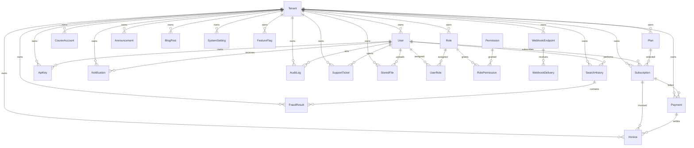

# Database ERD Summary

## Notes

- Tenant-ready modeling is present across tenant-owned records through `tenant_id`.
- Soft-delete support is represented through `deleted_at` on business records.
- Sensitive merchant credentials are represented only as encrypted credential payloads.
- Search and fraud result records are normalized for future analytics and AI risk scoring.